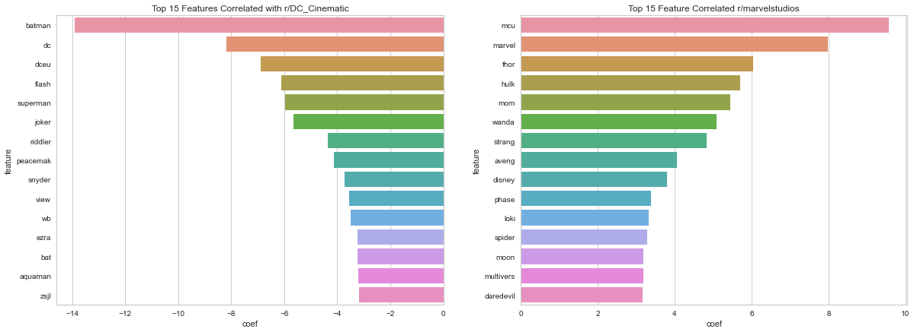

# Web APIs & NLP

## Objective

---

The objective is to create a model that is able to classify a post to either an Marvel or an DC post. To train the model, we will be using post from the subreddit as the train data. The intention is to generalized a trained model which will be use outside of reddit (e.g Twitter / Facebook).

After classifying the post, the model will also run a sentiment analysis. From the sentiment analysis, the top positive and negative words are identified to further aid the selection of superhero character to run market campaign and toy production.

The outcome of the analysis serves as a additional supporting document to recommend or to reject the superhero character or the brand.

## Summary

---

1. The model is able to successfully classify Reddit posts as r/DC_Cinematic & r/marvelstudios content, possible future applications include:
    - Classify data from other non-Reddit sources as Marvel/DC.
    - Can be used to to determine popularity/public interest in each brand.
    - Other downstream analysis e.g. sentiment analysis.

2. Key findings from sentiment analysis:
    - Able to identify most disccused superhero characters
        - Marvel: Ironman, Spiderman, Thor & Doctor Strange
        - DC: Batman, Superman, Wonder Woman & Joker
    - Key characters to avoid due to negative sentiment:
        - DC: Amber Heard & Ezra Miller 
    - Data could be utilized to develop toys and marketing initiatives:

## Data Sets

---

* [`raw_data_marvel.csv`](./data/raw_data_marvel.csv): Raw r/marvelstudios Data extracted using PushShiftAPI
* [`raw_data_dc.csv`](./data/raw_data_dc.csv): Raw r/DC_Cinematic Data extracted using PushShiftAPI
* [`main_data.csv`](./data/main_data.csv): Cleaned Consolidated Data of r/marvelstudios & r/DC_Cinematic
* [`manual_sentiment_annotated_data.csv`](./data/manual_sentiment_annotated_data.csv): 300 manually sentiment labelled posts data
* [`sentiment_result_cardinffnlp_twitter_roberta_base_sentiment.csv`](./data/sentiment_result_cardinffnlp_twitter_roberta_base_sentiment.csv): Sentiment Analysis Result

Saved Model using <code>Pickle</code>:
* [`logr_gs_cvec.pkl`](./data/logr_gs_cvec.pkl): Logistic Regression Model with CountVectorizer Model
* [`logr_gs_tvec.pkl`](./data/logr_gs_tvec.pkl): Logistic Regression Model with TfidfVectorizer Model
* [`nb_gs_cvec.pkl`](./data/nb_gs_cvec.pkl): Multinomial Naive Bayes Model with CountVectorizer Model
* [`nb_gs_tvec.pkl`](./data/nb_gs_tvec.pkl): Multinomial Naive Bayes Model with TfidfVectorizer Model
* [`rf_gs_cvec.pkl`](./data/rf_gs_cvec.pkl): Random Forest Classification Model with CountVectorizer Model
* [`rf_gs_tvec.pkl`](./data/rf_gs_tvec.pkl): Random Forest Classification with TfidfVectorizer Model
* [`pycaret_cvec.pkl`](./data/pycaret_cvec.pkl): PyCaret Model

## Data Acquisition:

---
The data was collected using the Pushshift's API on two subreddit, <code>r/marvelstudios</code> & <code>r/DC_Cinematic</code>. For each subreddit, a total of 10,000 post was collected. The actual total data collected was 9000+ as the API did not give exactly 100 post per request. However, due to the insignificance of the matter, the behaviour was ignored.

## Features and Target:

---

The main features are `title`, `selftext`, `author`.

The target is `subreddit`.

- The data passed through few steps of processing to clean the words and remove outliers:

    `Lower cased` -> `Demoji` -> `RegexTokenization` -> `StopWord` -> `Stemming` -> `Rejoined` -> `TFIDVectorizer`

- For the stemmer, two types (`Porter` & `Snowball`) were used for comparison further downstream.

## Modeling:

---

### **Baseline Model: Multinomial Naive Bayes Model**

---

As a reference model for our models to compared against, Multinomial Naive Bayes model was chosen as the baseline model as it is computationally fast and easy to interpret. The model was ran with two data which were either stemmed using `PorterStemmer` or `SnoballStemmer` for comparison. The better performing stemmer will be used downstream.

|    | estimator    | stemmer       | transformer  | train |  test |
|---:|:-------------|:------------- |:-------------|------:|------:|
|  0 | nb           | porter        | cvec         | 0.873 | 0.871 |
|  1 | nb           | snowball      | cvec         | 0.873 | 0.871 |

### **Model Preparation**

---

- Transformer used:
    1. CountVectorizer
    2. TfidfVectorizer

- Estimator used:
    1. Random Forest Classification
    2. Multinomial Naive Bayes
    3. Logistic Regression

Hyperparameter tuning was done by feeding the transformers and estimators to the `pipeline` and `GridSearchCV` to get the best model of the best parameters. The following are the results:

|    | estimator    | transformer  | train |  test |
|---:|:-------------|:-------------|------:|------:|
|  0 | lr           | cvec         | 0.910 | 0.914 |
|  1 | lr           | tvec         | 0.914 | 0.914 |
|  2 | nb           | cvec         | 0.912 | 0.916 |
|  3 | nb           | tvec         | 0.913 | 0.916 |
|  4 | rf           | cvec         | 0.903 | 0.905 |
|  5 | rf           | tvec         | 0.905 | 0.905 |

- The model performs better with low <code>min_df</code>, meaning that it performs better with more features.
- Model from <code>GridSearchCV</code> are well fitted and was able to effectively classify post to *r/marvelstudios* & *r/DC_Cinematic*.
- Both transfromer perform very similarly.
- The model was able to out perform the baseline model.

### **Final Model Selection**

---

- **Logistic regression model was recommended as the production model** for the following reasons:

    1. The logistic regression model achieve a very high accuracy score.
    
    2. The top features reflect a diverse superhero character within each comic/movies, which is good as a generalize model.
    3. Easier to interpret compared to random forest classification. 
    4. Naive Bayes model perform similarly well (slightly better as a matter of fact), but the model use the assumption of independence between words, which was clearly not the case as the most important features of r/DC_Cinematic was shown to be closely related to a single movie or character *batman*

Top 15 features identified with Logistic regression log coefficient:

